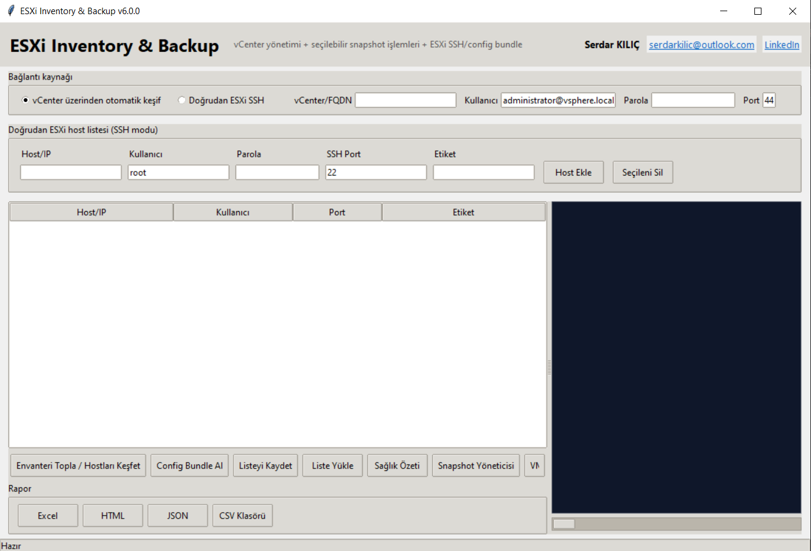
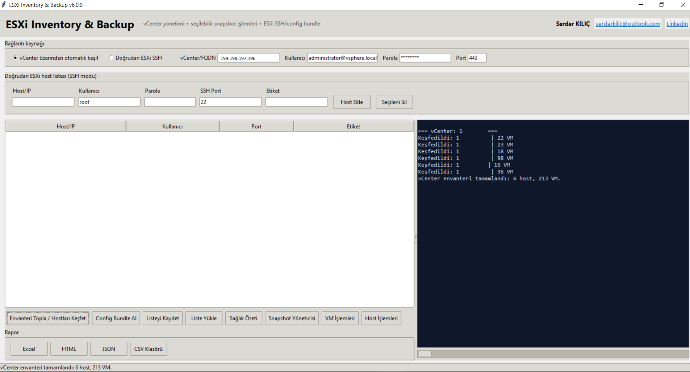
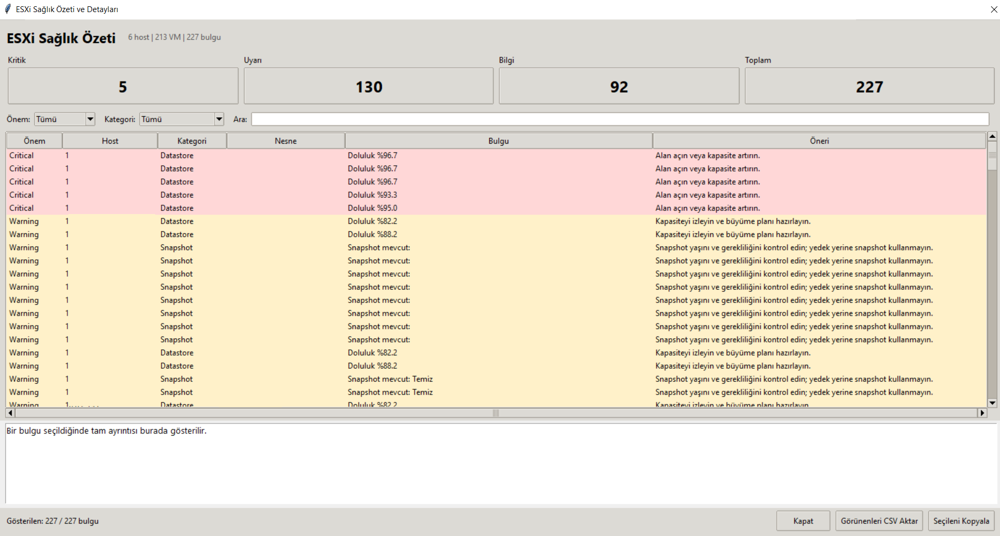
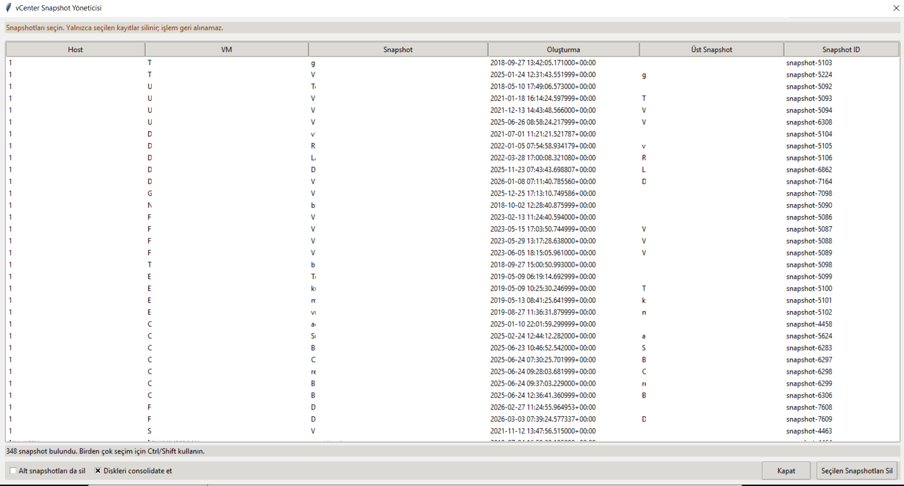

# ESXi Inventory Manager

[English](README.md) | [Türkçe](README_TR.md)

ESXi Inventory Manager; VMware ESXi ve vCenter ortamlarını keşfetmek, envanterini çıkarmak, sağlık durumunu izlemek ve raporlamak için geliştirilmiş bir Windows masaüstü uygulamasıdır.

## Özellikler

- ESXi ve vCenter bağlantısı
- Host sağlık durumu özeti
- Sanal makine envanteri
- VM donanım bilgileri
- İşletim sistemi ve IP adresi bilgileri
- Datastore kapasite takibi
- Snapshot keşfi ve yönetimi
- Envanter ve sağlık raporları
- HTML ve Excel rapor desteği
- Alarm ve bildirim altyapısı

## Ekran Görüntüleri

### Ana Panel

### Sanal Makine Envanteri

### Host Sağlık Durumu

### Snapshot Yönetimi

## Sistem Gereksinimleri

- Windows 10 veya Windows 11
- Windows Server 2016 veya üzeri
- VMware ESXi veya VMware vCenter erişimi
- Hedef sisteme ağ bağlantısı

## Kurulum

1. GitHub üzerindeki Releases bölümünü açın.
2. En güncel ZIP paketini indirin.
3. ZIP dosyasını bir klasöre çıkartın.
4. `EsxiInventoryManager.exe` dosyasını çalıştırın.
5. ESXi veya vCenter bağlantı bilgilerini girin.

## İndirme

Programın en güncel sürümü GitHub Releases bölümünden indirilebilir.

## Güvenlik

Uygulamaya girilen erişim bilgileri GitHub üzerinde yayınlanmaz.

Parola, API anahtarı, vCenter erişim bilgisi, yapılandırma dosyası veya hassas bilgi içeren log dosyalarını GitHub'a yüklemeyin.

## Hata Bildirimi

Hataları ve yeni özellik taleplerini GitHub üzerindeki Issues bölümünden bildirebilirsiniz.

Hata bildirirken aşağıdaki bilgileri ekleyin:

- Uygulama sürümü
- Windows sürümü
- ESXi veya vCenter sürümü
- Alınan hata mesajı
- Hassas bilgiler temizlenmiş ilgili log kayıtları

## Lisans

Bu uygulama kapalı kaynak kodlu ve ücretsiz bir yazılım olarak dağıtılmaktadır.

Kaynak kod kamuya açık olarak paylaşılmamaktadır.
